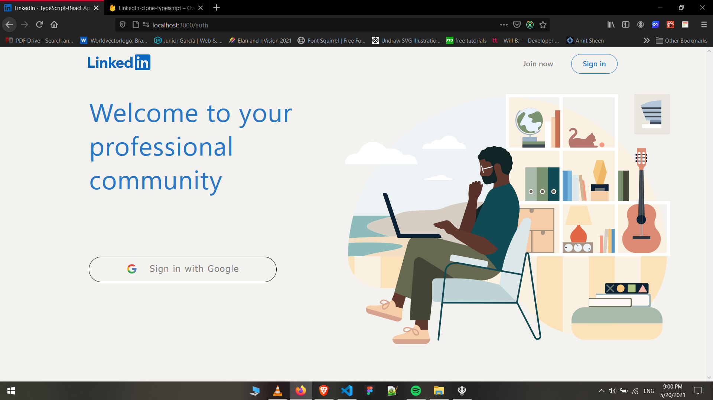
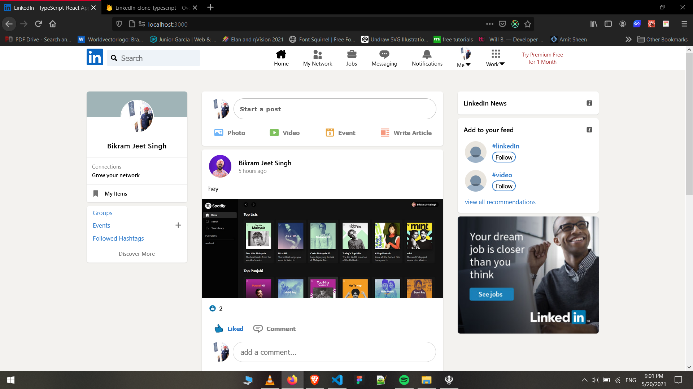
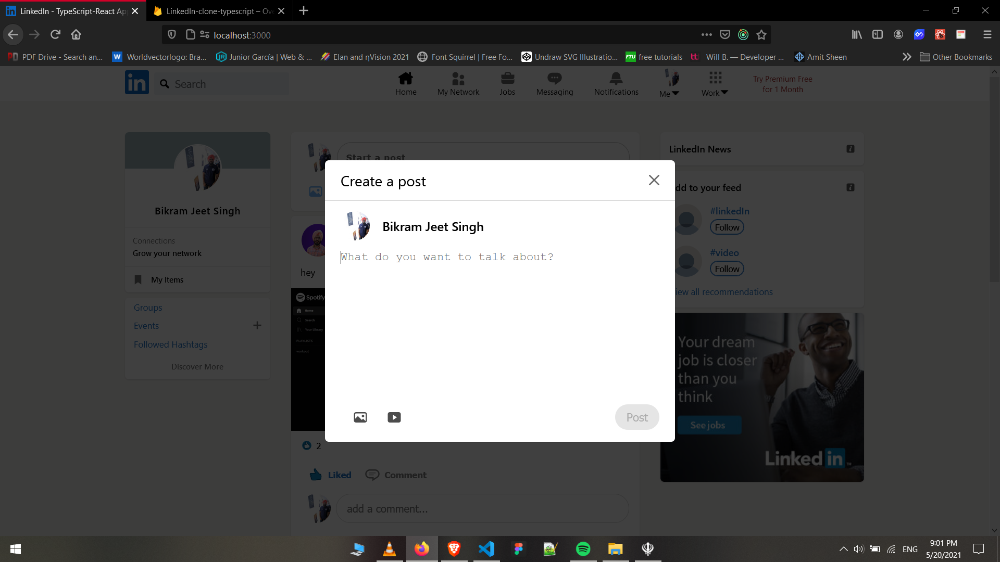

<br>
<br>
<div align="center">
  
</div>
<br>

<p 
align="center" 
style="font-size:2rem; letter-spacing: 4px;">
Using 
<br/> ReactJs, TypeScript, Firebase  and styled-components
<br />
Fully Responsive
</p>
<br>

## Packages Used:
<ul>
 <li>create-react-app - Used as UI Library with typescript as a template.</li>
 <li>redux - Used for the state management in the app.</li>
 <li>firebase - Used for the the database and deployment.</li>
 <li>react-router-rom - Used as a routing library.</li>
 <li>styled-components - Used as styling the app.</li>
 <li>react-spinners - Used for the loader components</li>
 <li>moment - Used for the time-ago functionality.</li>
</ul>
<br>

## Features
   1. Google Authentication
   2. No-SQL Database - Firestore
   3. Storage for image/video 
   4. Create, Read and Delete - posts & comments
   5. Like a post

<br>
## Preview of the Project: 

<div align="center">
  <h3>1. Login-Screen</h3>
  
</div>

<br>

<div align="center">
  <h3>2. Home-Screen</h3>
  
</div>

<br>

<div align="center">
  <h3>3. Create-post</h3>
  
</div>

<br>
<br>

## Firebase installation
Sign up and create a firebase project *[here](https://firebase.google.com/)*. Click on the web icon, and then go to project settings and get the firebase config and paste in the *src/config/firebase.ts*
<br>
Set up the authentication, firestore and hosting in firebase.

<br>

## Installation and set-up

1. Install all the dependencies
    
    ```
    npm install
     ```  
2. Start the development server
    
    ```
   npm start
    ```
3. Login into firebase

    ```
    firebase login
    ```

## Production Build

1. Generate the production build
   
   ```
   firebase init
   ``` 
   ```
   npm run build
   ``` 
2. Deploy the App

    ```
    firebase deploy
    ```